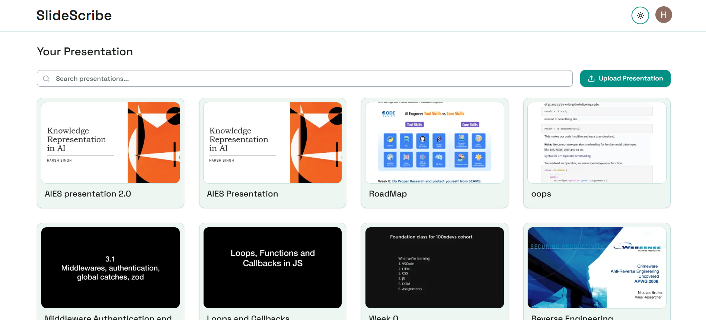
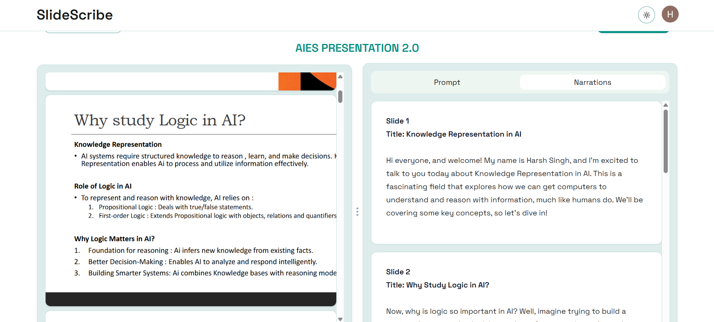
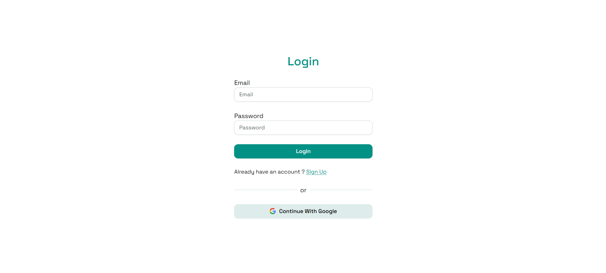

# SlideScribe 🎯

[](https://github.com/your-username/slidescribe/releases)
[](https://nextjs.org/)
[](https://tailwindcss.com/)
[](https://www.mongodb.com/)
[](https://cloudinary.com/)

An intelligent presentation companion that transforms your PowerPoint and PDF presentations into engaging, well-crafted narratives using advanced AI technology.
---

## 📸 Demo Screenshots

<div align="center">
  
  
  
</div>

---

## 🛠️ Tech Stack

- **Frontend**: Next.js 14 with TypeScript
- **Styling**: TailwindCSS
- **Database**: MongoDB with Prisma ORM
- **File Storage**: Cloudinary
- **AI Model**: Google Gemini 1.5
- **Authentication**: [Your auth solution]
- **Deployment**: [Your deployment platform]

---

## 📦 Installation

1. **Clone the repository**
   ```bash
   git clone https://github.com/[your-username]/slidescribe.git
   cd slidescribe
   ```

2. **Install dependencies**
   ```bash
   npm install
   # or
   yarn install
   ```

3. **Set up environment variables**
   ```bash
   cp .env.example .env.local
   ```

   Fill in your environment variables:
   ```env
   DATABASE_URL="your_mongodb_connection_string"
   CLOUDINARY_CLOUD_NAME="your_cloudinary_cloud_name"
   CLOUDINARY_API_KEY="your_cloudinary_api_key"
   CLOUDINARY_API_SECRET="your_cloudinary_api_secret"
   GEMINI_API_KEY="your_gemini_api_key"
   NEXTAUTH_URL="http://localhost:3000"
   NEXTAUTH_SECRET="your_nextauth_secret"
   ```

4. **Set up the database**
   ```bash
   npx prisma generate
   npx prisma db push
   ```

5. **Run the development server**
   ```bash
   npm run dev
   # or
   yarn dev
   ```

   Open [http://localhost:3000](http://localhost:3000) to view the application.

---

## 🎯 How It Works

1. **Upload**: Upload your PowerPoint (.ppt/.pptx) or PDF presentation  
2. **Process**: Our AI analyzes each slide's content, images, and structure  
3. **Generate**: Receive a comprehensive narration script tailored to your presentation  
4. **Enhance**: (Coming soon) Convert to speech, practice with AI, and get improvement tips  

---

## 🌟 Key Benefits

- **Time-Saving**: Generate professional scripts in minutes, not hours  
- **Consistency**: Maintain consistent tone and flow throughout your presentation  
- **Accessibility**: Make presentations more accessible with audio narration  
- **Skill Development**: Improve presentation skills with AI-powered coaching  
- **Performance Optimized**: Lightning-fast loading with superior user experience  

---

## 📊 Performance Metrics

- **Processing Speed**: 100+ slides per hour  
- **Lighthouse Score**: 99/100 performance rating  
- **Uptime**: 99.9% availability  
- **User Satisfaction**: [Add your metrics]  

---

## 🚀 Features

### ✅ Current Features
- **AI-Powered Script Generation**: Generate detailed, professional narration scripts from PowerPoint (.ppt/.pptx) and PDF presentations
- **High-Performance Processing**: Process 100+ slides per hour using Google's Gemini 1.5 model
- **Optimized User Experience**: Lazy loading implementation with 99/100 Lighthouse performance score
- **Cloud Storage Integration**: Seamless file upload and management with Cloudinary
- **Responsive Design**: Mobile-first approach with TailwindCSS styling

### 🔄 Coming Soon
- **Text-to-Speech Narration**: Convert generated scripts to high-quality audio with presentation timing guidance
- **Presentation Summarizer**: Get concise summaries of your presentations for quick reviews
- **AI Presentation Coach**: Receive personalized tips and suggestions to improve your presentation skills
- **Practice Mode**: Interactive practice sessions with AI feedback on your delivery
- **Voice Analysis**: Real-time feedback on pace, tone, and clarity during practice sessions


## 🤝 Contributing

We welcome contributions! Please see our [Contributing Guidelines](CONTRIBUTING.md) for details.

1. Fork the repository  
2. Create a feature branch (`git checkout -b feature/amazing-feature`)  
3. Commit your changes (`git commit -m 'Add amazing feature'`)  
4. Push to the branch (`git push origin feature/amazing-feature`)  
5. Open a Pull Request  

---

## 🙏 Acknowledgments

- Google Gemini team for the powerful AI model  
- The open-source community for the amazing tools and libraries  
- Our beta testers for valuable feedback  

---

## 📞 Support

- **Documentation**: [Link to docs]  
- **Issues**: [GitHub Issues](https://github.com/[your-username]/slidescribe/issues)  
- **Email**: support@slidescribe.com  
- **Discord**: [Your Discord server]  

---

## 🗺️ Roadmap

- [ ] Multi-language support for script generation  
- [ ] Integration with popular presentation platforms (Google Slides, Canva)  
- [ ] Real-time collaboration features  
- [ ] Advanced analytics and presentation insights  
- [ ] Enterprise features and SSO integration  

---

[⭐ Star us on GitHub](https://github.com/HarshS490/slidescribe) 
